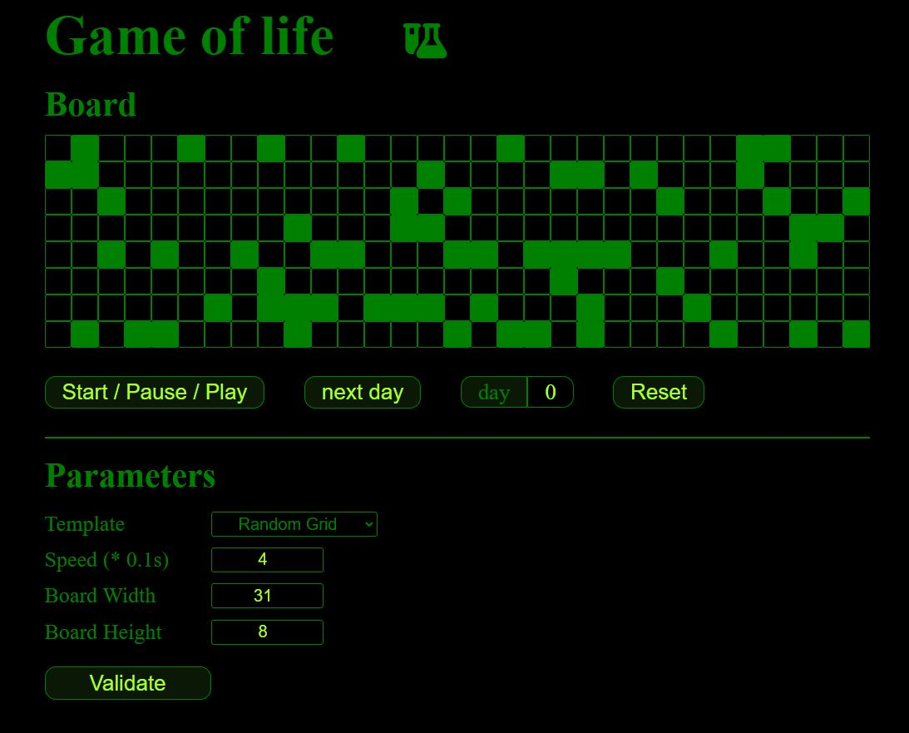

# Game of Life

Projet proposé par freecodecamp. Outre délivrer un jeu fonctionnel, j'ai ajouté les contraintes suivantes :

- mode pas à pas ou automatique
- grille aléatoire de taille paramétrable
- vitesse en mode automatique réglable
- old design
- ajouter un module permettant de créer des mots qui serviront de template

## Axes d'amélioration

Arreter le jeu lorsque le jeu n'évolue plus

### `lezardon`

Runs the app in the development mode.\
Open [http://localhost:3000](http://localhost:3000) to view it in your browser.
